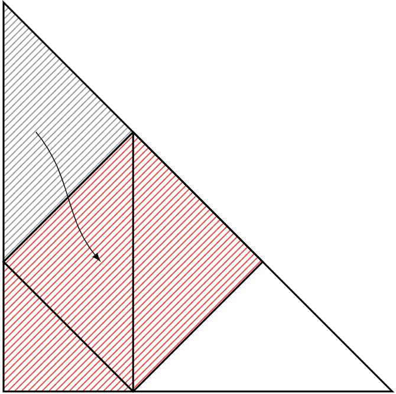

---
[TOP](../README.md) > [パズル](./puzzle_home.md) > [図形](./puzzle_zukei.md)

---
# パズル！ - 図形
---

最終更新(2025/02/27)　投稿日(2025/2/26)

    

- [パズル！ - 図形](#パズル---図形)
    - [面積を求めよう-1](#面積を求めよう-1)
    - [面積を求めよう-2](#面積を求めよう-2)
    - [角度は？](#角度は)

---
### 面積を求めよう-1
Q. 次の斜線部の面積は？

    

  
 ヒント 

  正方形と斜線部の面積比を考える
  

    
  

    
 答え 

    

    
    
  

  
このように見れば \( (正方形)\times\frac{5}{4} = (斜線部) \) となる。 
  また\((三角形全体) = (正方形)+(斜線部) = \frac{9}{5}\times(斜線部)\)であり、同時に 
  \((三角形全体) = \frac{1}{2}\times6\times6=18\)である。 
  以上から\((斜線部) = \frac{5}{9}\times(三角形全体) = 10\)

---
### 面積を求めよう-2
Q. 次の斜線部の面積は？

    

  
 ヒント 

  5の長さをそのまま中心部に移動する
  

    
  

    
 答え 

    

    
    
  

  
このように見れば中心の正方形の対角線の長さが\(10\)とわかる 
  従って面積は\(\frac{1}{2}\times10\times10=50\)

---
### 角度は？
Q. 次の図の「?」の角度は？

    

    
 答え 

    

    
  

  
この補助線によって上側2辺を見ると、直角かつ同じ長さである。 
  従って\(90°,45°,45°\)の三角形とわかる。求めるのは\(45°\)

---