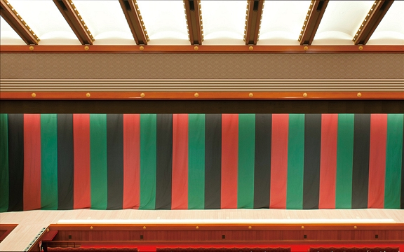

---
[TOP](./README.md)

---
# クイズまとめサイト!

---

最終更新(2025/01/13)　投稿日(2025/01/12)

<!-- このjsスクリプト、反映されないかも、、 -->

    

<!-- htmlタグからのhrefをする際には、github pagesがレンダーしたのちの~.htmlで指定します -->

    
・<a class="acc" href="#ひもで時間計測">現在掲載中の問題へ!</a>

    
・今までの問題の <a href="./SUMMARY.html">保管庫へ</a>

    
・このサイトでは<a href="./Puzzle/puzzle_home.html">パズル</a>や<a href="./Trivia/trivia_home.html">トリビア</a>クイズをまとめています。

    <!-- コメントアウトされた箇所はそのまま -->
    <!-- 
左の目次バーからジャンル毎の出題も見れます。
 -->
    
・上部のパンくずリストの<a>TOP</a>でここに戻れます。

<!-- cssを埋め込む！ ここまで-->

---

- [クイズまとめサイト!](#クイズまとめサイト)
  - [-パズル-](#-パズル-)
    - [ひもで時間計測](#ひもで時間計測)
    - [ピッタリ水汲み](#ピッタリ水汲み)
  - [-トリビア-](#-トリビア-)
    - [「勿忘草」](#勿忘草)
    - [「寤寐思服」](#寤寐思服)
    - [「鳩尾」](#鳩尾)
    - [「窈窕」](#窈窕)
    - [歌舞伎で見る幕](#歌舞伎で見る幕)
    - [マリトッツォの意味](#マリトッツォの意味)
    - [昼過ぎの眠気](#昼過ぎの眠気)
  - [参考としているサイト群](#参考としているサイト群)

---
## -パズル-

### ひもで時間計測
Q. ちょうど1時間で燃えるひもが2本あります。マッチとひもを使って45分を計測してください。ひもに目印をつけたりはできません。

  
 ヒント 

  1時間以外を計測するためにできることを探そう。
  両端から同時に火をつけることで半分の時間を計測できることに気付けるかが勝負である。

  
 回答 

  初めに火を3箇所(一本目の両端と二本目の片端)につけて、一本目が燃え切った時点で30分が計測できる。そのタイミングで二本目の端に火をつけることで、残り30分の半分である15分を加え、目標の45分が測れる。

---
### ピッタリ水汲み
Q. 5Lと3Lの容器が一つずつあります。これを用いて以下の2操作だけで4Lを計量してください。
- 水を満杯まで入れる
- 水を全て捨てる
- 他方が満杯になるまで移す

  
 回答 

  回答は一つではないですのであくまで一例です。
  - 5L容器を満杯にし、3L容器に移す
  - 3L容器の水を捨てて、5L容器に残った2Lを3L容器に移す
  - 5L容器を満杯にし、3L容器に1L分移すことで5L容器に4L残る。
  
  他の解法としても
  - 3L容器を満たして、5L容器に移す。
  - もう一度3L容器を満たして5L容器に2L分移す。
  - 5L容器を空にして、3L容器に残った1L分を5Lに移す。
  - 3L容器を満たして5L容器に移して4Lとなる。

---

## -トリビア-

### 「勿忘草」

  
 意味 

  英名は「forget-me-not」ともいう植物。
  英名も含めて楽曲のタイトルとして多用される。  
  なお、この命名はドイツの物語でのセリフ"Vergiss-mein-nicht!"（僕のことを忘れないで！）に由来している。

  
 答え 

  「わすれなぐさ」

---
### 「寤寐思服」

  
 意味 

  寝ても覚めても忘れられないこと、また人に対する思いが切ないこと
  「寤」は起床すること。「寐」は就寝すること。「思服」はいつも思っていること。

  
 答え 

  「ごびしふく」

---
### 「鳩尾」

  
 意味 

  胸とへその間のへこんだ部分。心窩部（しんかぶ）ともいう。

  
 答え 

  「みぞおち」

---
### 「窈窕」

  
 意味 

  美しくしとやかなさま。上品で奥ゆかしいさま。

  
 答え 

  「ようちょう」

---
### 歌舞伎で見る幕
Q. この幕はなんという？

  
 答え 

  「定式幕」(じょうしきまく)

  
 解説 

  それぞれの色は黒色、柿色、萌葱色と言う。なお、流派によって色使いや順番の異なるものもある。
  また、歌舞伎にはさまざまな幕が登場する。「黒幕」の語源も歌舞伎のそれであることも有名。
  画像の引用先の<a href="https://enmokudb.kabuki.ne.jp/phraseology/2569/">サイト</a>で詳しく勉強もできます。

---

### マリトッツォの意味
Q. イタリアのお菓子として知られるマリトッツォ。その名前の由来は？

  
 答え 

  「小さな夫」

  
 解説 

  イタリア語で夫を意味する「マリート（Marito）」からきているというのが有力である。
  昔、男性がマリトッツォの中に婚約指輪を入れて女性にプロポーズするという習慣があったとかなかったとか、、

---
### 昼過ぎの眠気
Q. 午後に眠くなるという傾向を英語でなんというか？

  
 答え 

  
  アフタヌーンディップ
  ポストランチディップ

  
 解説 

  
  ほぼ直訳、dipは落ち込むといった意味である。
  午後の眠気は食事による血糖値の上昇が要因と考えやすいが、食事がなくても昼過ぎに眠気が来るという実験があったそうで、、

---
---

## 参考としているサイト群
- [goo辞書](https://dictionary.goo.ne.jp/)
- [Wikipedia](https://ja.wikipedia.org/wiki/%E3%83%A1%E3%82%A4%E3%83%B3%E3%83%9A%E3%83%BC%E3%82%B8)
- [四字熟語辞典オンライン](https://yoji.jitenon.jp/)