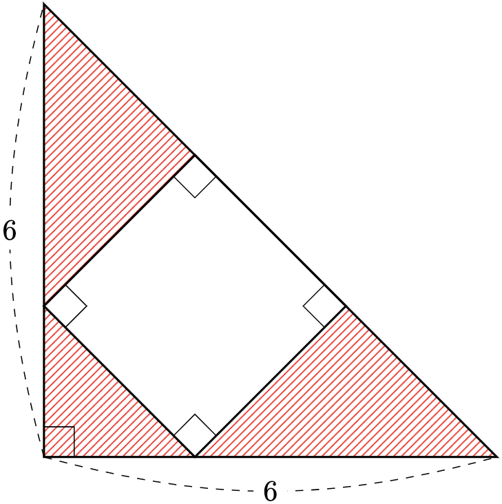
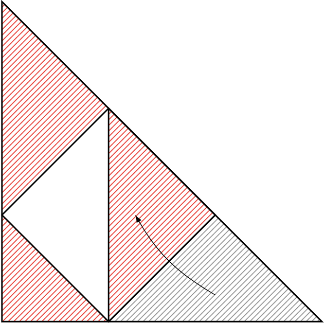
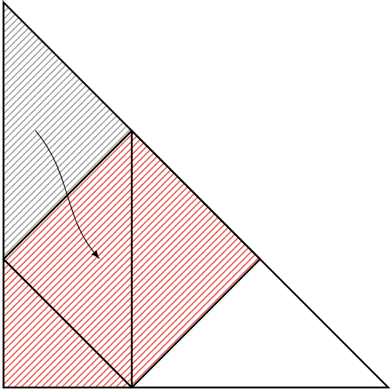
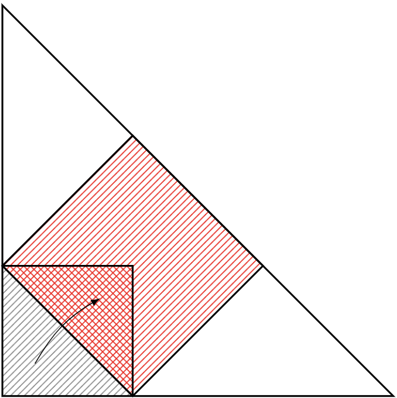
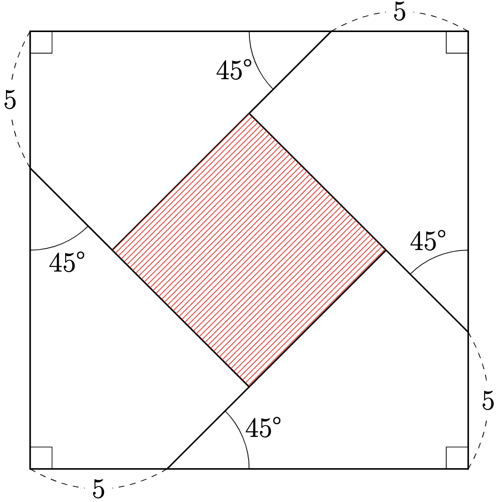
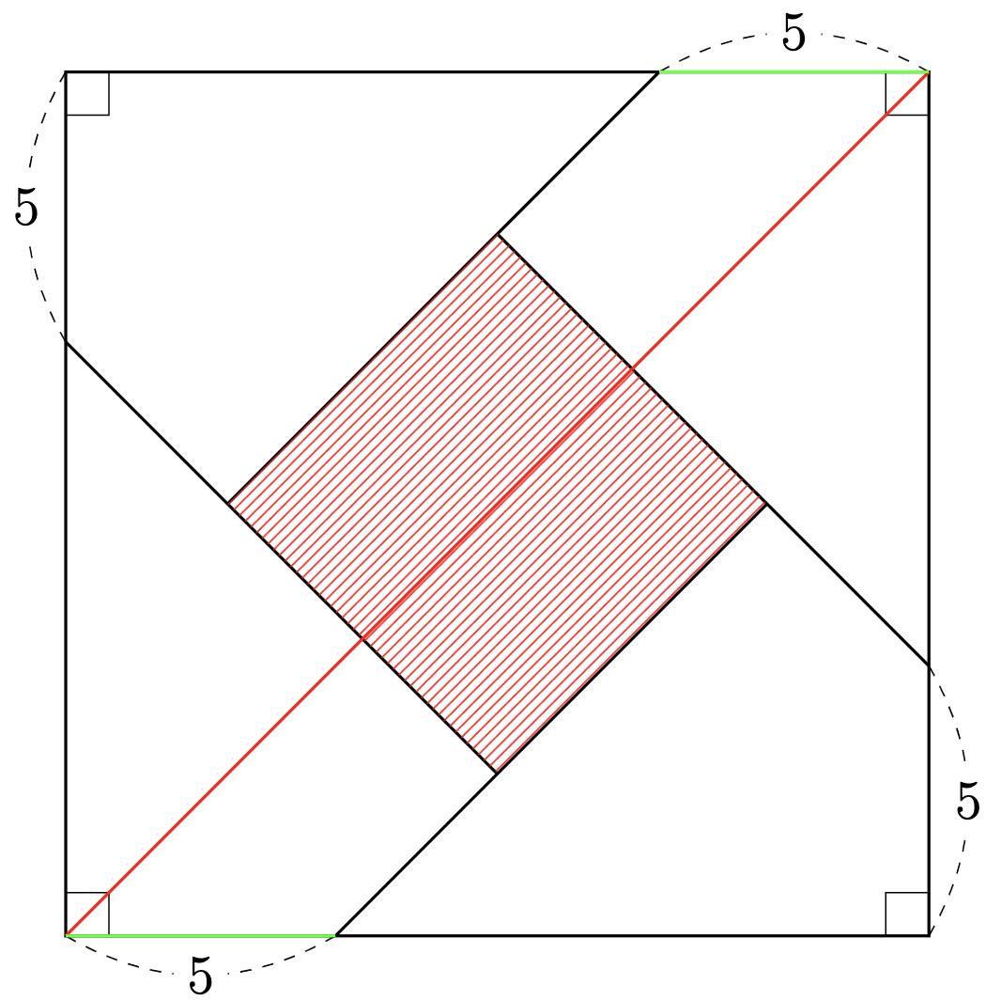
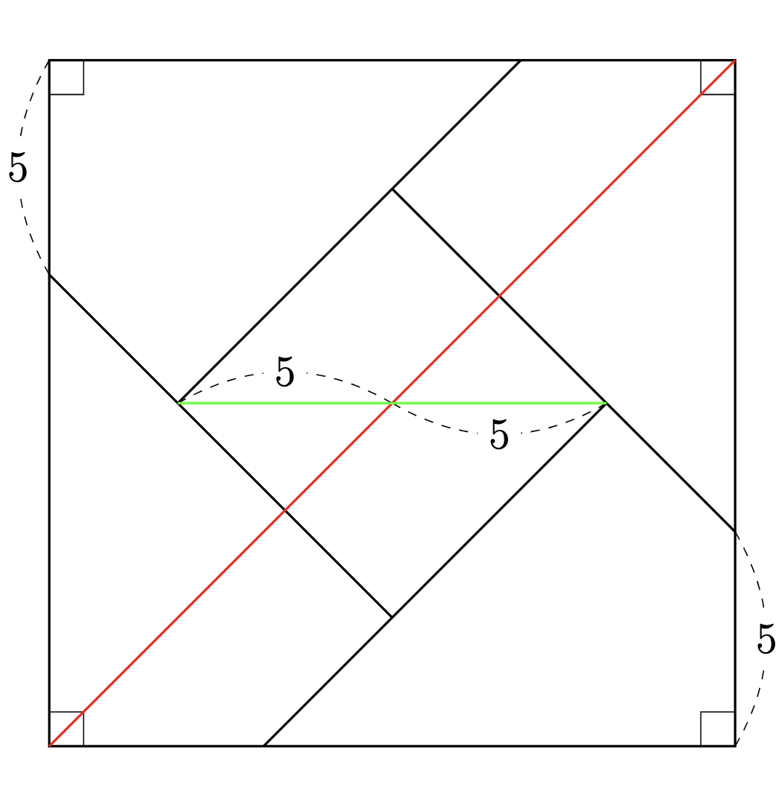
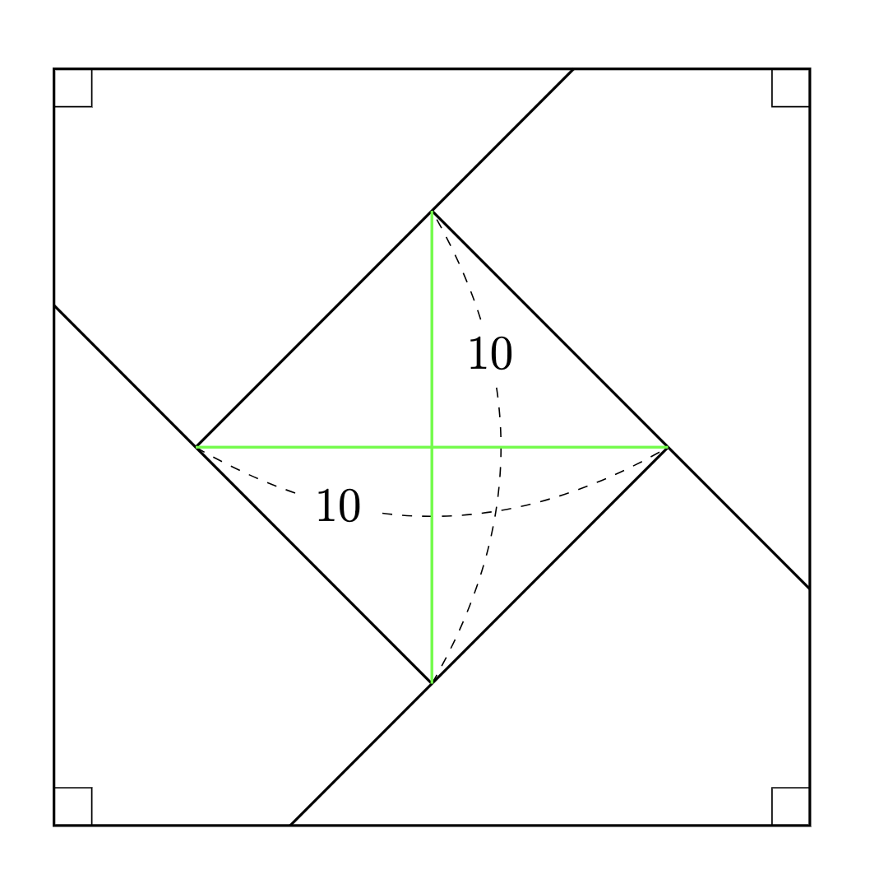
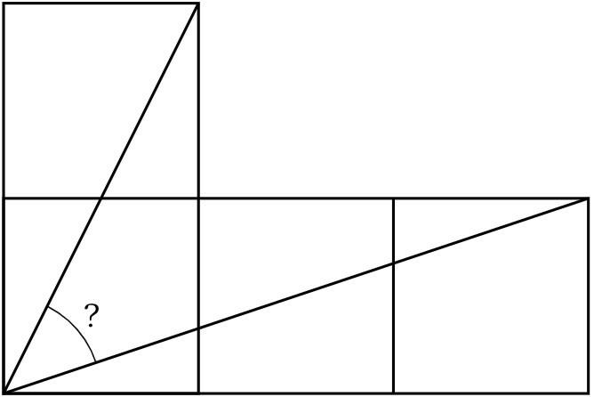
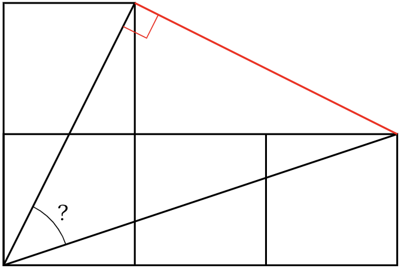

---
[TOP](./README.md)

---
# クイズまとめサイト!

---

最終更新(2025/02/27)　投稿日(2025/01/12)

<!-- このjsスクリプト、反映されないかも、、 -->

<!--  -->

    

<!-- htmlタグからのhrefをする際には、github pagesがレンダーしたのちの~.htmlで指定します -->

    
・<a class="acc" href="#どっちが早く転がる">現在掲載中の問題へ!</a>

    
・今までの問題の <a href="./SUMMARY.html">保管庫へ</a>

    
・このサイトでは<a href="./Puzzle/puzzle_home.html">パズル</a>や<a href="./Trivia/trivia_home.html">トリビア</a>クイズをまとめています。

    <!-- コメントアウトされた箇所はそのまま -->
    <!-- 
左の目次バーからジャンル毎の出題も見れます。
 -->
    
・上部のパンくずリストの<a>TOP</a>でここに戻れます。

<!-- cssを埋め込む！ ここまで-->

---

- [クイズまとめサイト!](#クイズまとめサイト)
  - [-パズル-](#-パズル-)
    - [ひもで時間計測](#ひもで時間計測)
    - [ピッタリ水汲み](#ピッタリ水汲み)
    - [面積を求めよう-1](#面積を求めよう-1)
    - [面積を求めよう-2](#面積を求めよう-2)
    - [角度は？](#角度は)
  - [-トリビア-](#-トリビア-)
    - [そば処の"おばけ"](#そば処のおばけ)
    - [ものの数え方 ~ お箸は一膳 ~](#ものの数え方--お箸は一膳-)
    - [どっちが早く転がる？](#どっちが早く転がる)
  - [参考としているサイト群](#参考としているサイト群)

---
## -パズル-
---

### ひもで時間計測
Q. ちょうど1時間で燃えるひもが2本あります。マッチとひもを使って45分を計測してください。ひもに目印をつけたりはできません。

  
 ヒント 

  1時間以外を計測するためにできることを探す。 
  両端から同時に火をつけることで半分の時間を計測できることに気付けるかが勝負である。

  
 回答 

  初めに火を3箇所(一本目の両端と二本目の片端)につけて、一本目が燃え切った時点で30分が計測できる。そのタイミングで二本目の端に火をつけることで、残り30分の半分である15分を加え、目標の45分が測れる。

---
### ピッタリ水汲み
Q. 5Lと3Lの容器が一つずつあります。これを用いて以下の2操作だけで4Lを計量してください。
- 水を満杯まで入れる
- 水を全て捨てる
- 他方が満杯になるまで移す

  
 ヒント 

  4Lを(3+1)Lと見るなら1Lを作りたい。 
  他にも(5-1)Lと見るなら5L満杯から3L容器に1L入れることを考える。その時の3L容器に2Lだけあれば良い。 
  つまり3, 5以外にも1, 2Lの水を作ることを目標にする。

  
 回答 

  回答は一つではないですのであくまで2つ例を紹介します。
  <ul>
    <li>5L容器を満杯にし、3L容器に移す</li>
    <li>3L容器の水を捨てて、5L容器に残った2Lを3L容器に移す</li>
    <li>5L容器を満杯にし、3L容器に1L分移すことで5L容器に4L残る。</li>
  </ul>

  他の解法としても

  <ul>
    <li>3L容器を満たして、5L容器に移す。</li>
    <li>もう一度3L容器を満たして5L容器に2L分移す。</li>
    <li>5L容器を空にして、3L容器に残った1L分を5Lに移す。</li>
    <li>3L容器を満たして5L容器に移して4Lとなる。</li>
  </ul>

  
図解はいつかきっと、、

---
### 面積を求めよう-1
Q. 次の斜線部の面積は？

    

  
 ヒント 

  正方形と斜線部の面積比を考える
  

    
  

    
 答え 

    

    
    
  

  
このように見れば \( (正方形)\times\frac{5}{4} = (斜線部) \) となる。 
  また\((三角形全体) = (正方形)+(斜線部) = \frac{9}{5}\times(斜線部)\)であり、同時に 
  \((三角形全体) = \frac{1}{2}\times6\times6=18\)である。 
  以上から\((斜線部) = \frac{5}{9}\times(三角形全体) = 10\)

---
### 面積を求めよう-2
Q. 次の斜線部の面積は？

    

  
 ヒント 

  5の長さをそのまま中心部に移動する
  

    
  

    
 答え 

    

    
    
  

  
このように見れば中心の正方形の対角線の長さが\(10\)とわかる 
  従って面積は\(\frac{1}{2}\times10\times10=50\)

---
### 角度は？
Q. 次の図の「?」の角度は？

    

    
 答え 

    

    
  

  
この補助線によって上部2辺を見ると、直角かつ同じ長さである。 
  従って90°-45°-45°の三角形とわかる。求めるのは45°

---
## -トリビア-

---
### そば処の"おばけ"
Q. そば/うどん屋のメニューに「おばけ」というものがある。どのような料理か？

  
 答え 

  油揚げと揚げ玉が両方乗せられたもの

  
 解説 

  日本では料理の名称や、同名の料理でも調理法に地域差がある。 
  関東で「きつね」というと油揚げ、「たぬき」というと天かすの乗ったものを指すことが多い。この二種の動物は共に「化かす」動物であり、それが由来とされる。 
  なぜ狐が油揚げを指すのか、一つは油揚げがきつね色であることが理由だそう。他にも「いなり寿司」と稲荷のきつねとの関係なども調べてみよう

---
### ものの数え方 ~ お箸は一膳 ~
Q. 次のものを数える時に共通する単位は？

<ol>
  <li>はさみ,豆腐 
    

    
 答え 

    ・丁(ちょう)
    

  </li>

  <li>鳥居,ピラミッド 
    

    
答え

    ・基(き)
    

  </li>

  <li>昆布,鰹節 
    

    
答え

    ・連(れん)
    

  </li>
</ol>

---

---
### どっちが早く転がる？
Q. 中身が液体のコーヒー缶と凍らせた缶、どちらが早く坂を転がるでしょうか？

  
 答え 

  

  <iframe width="384" height="682" src="https://www.youtube.com/embed/bCZqEM8l0qo" title="どっちが早く転がる？" frameborder="0" allow="accelerometer; autoplay; clipboard-write; encrypted-media; gyroscope; picture-in-picture; web-share" referrerpolicy="strict-origin-when-cross-origin" allowfullscreen></iframe>
  

---
## 参考としているサイト群
- [goo辞書](https://dictionary.goo.ne.jp/)
- [Wikipedia](https://ja.wikipedia.org/wiki/%E3%83%A1%E3%82%A4%E3%83%B3%E3%83%9A%E3%83%BC%E3%82%B8)
- [四字熟語辞典オンライン](https://yoji.jitenon.jp/)
- [ド文系でも楽しい【ゆっくり数学の雑学】](https://youtube.com/@yukkuri_suugaku?si=2T8hw85K5uSuZebs)